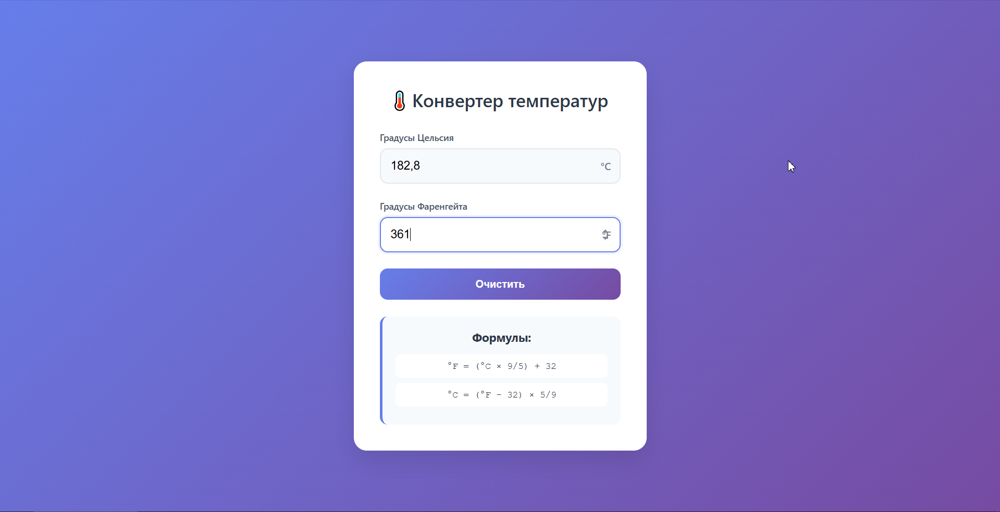
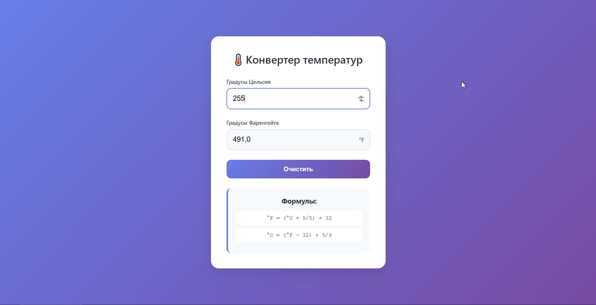

Простое React-приложение для конвертации температур между градусами Цельсия и Фаренгейта.
Функциональность:
- Конвертация Цельсий → Фаренгейт
- Конвертация Фаренгейт → Цельсий  
- Автоматический пересчет при вводе
- Красивый адаптивный интерфейс
Технологии:
- React
- CSS
- HTML

